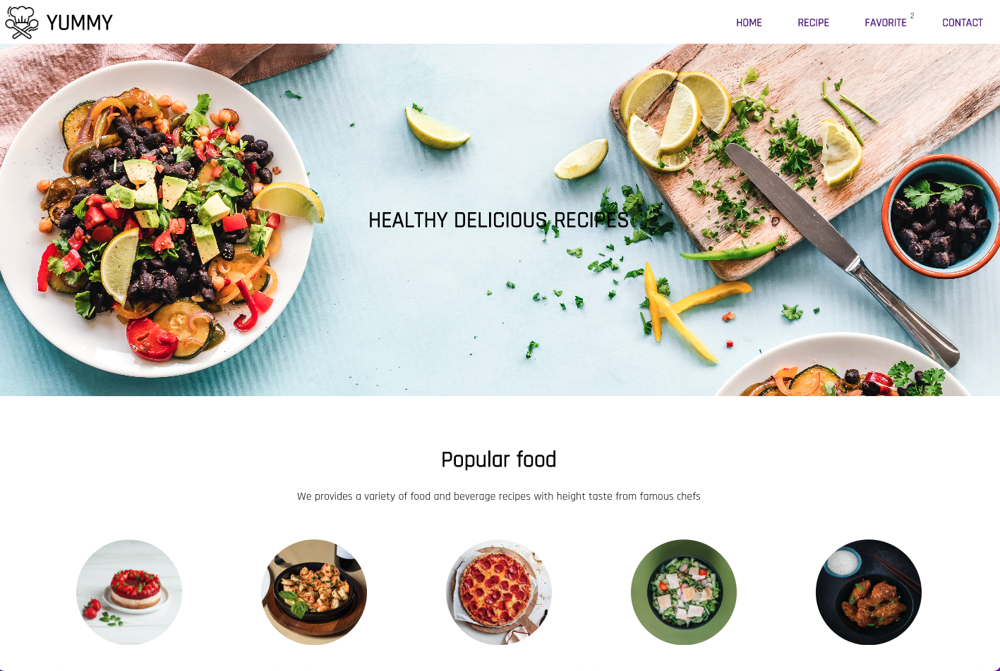
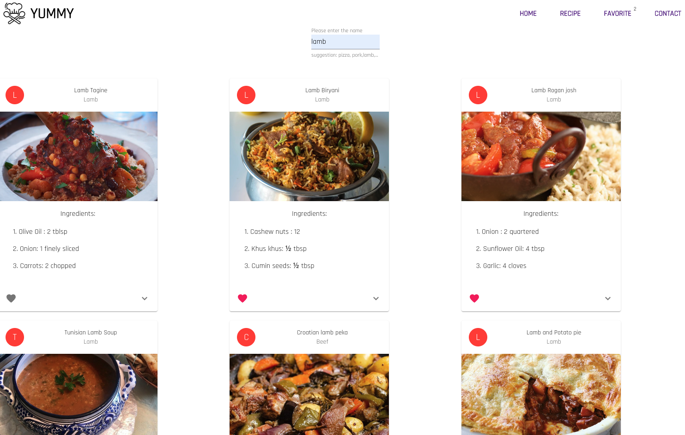
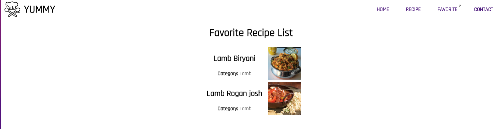
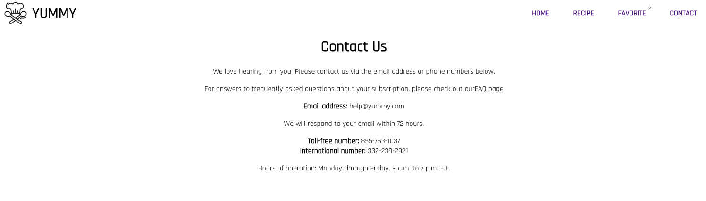

# React Project

## How to run project

1. Step 1: `yarn`
2. Step 2: `yarn start`

## Requirements

1. Your application should have 4 pages namely: `Home`, `Recipe` ,`Favorite` and `Contact`
2. Create a form where the user can insert the meal name
3. Using the user input above to get the recipe using this api : `https://www.themealdb.com/api/json/v1/1/search.php?s=${userInput}`. For example, if the user type `pizza` then the url will be: `https://www.themealdb.com/api/json/v1/1/search.php?s=pizza`
4. If the recipe is not found, display this message: `Sorry we have not got this recipe yet ! `
5. The user can add their favorite by clicking the heart icon and the favorite recipes show in `Favorite` page.
6. Styling had to be similar with the screenshot below

## Screenshots

1. Home page
   

2. Recipe page
   

3. Favorite page
   

4. Contact page
   

## Notes

1. The API docs: `https://www.themealdb.com/api.php`
2. The images can be found in `assets` folder
3. Google font: `https://fonts.google.com/` (`Rajdhani ,sans-serif`)
4. MUI:`https://mui.com/`
5. Ant design: `https://ant.design/`

## Reading materials MUI

1. Text Field: use in `Search` component (`https://mui.com/material-ui/react-text-field/#main-content`)
2. Card: use to display each recipe (`https://mui.com/material-ui/react-card/#main-content`)
3. Icons (`https://mui.com/material-ui/material-icons/#main-content`)
4. Button (`https://mui.com/material-ui/react-button/#main-content`)
5. Badge: (`https://mui.com/material-ui/react-badge/#main-content`)

## Hints

- You will need 3 states in this project
- CSS:clip-path. Read more here: `https://developer.mozilla.org/en-US/docs/Web/CSS/clip-path`
